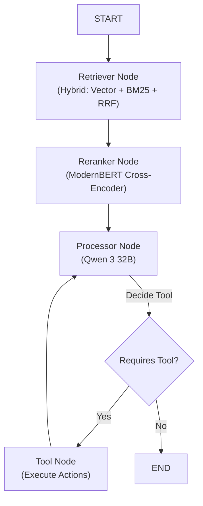

# 🌍 GAIA Benchmark Agent

**An Advanced Multi-Modal AI Agent designed to solve complex, real-world reasoning tasks.**


> [!NOTE]
> This project was developed as part of the **Hugging Face Agents Course (Unit 4: GAIA)**.

## 📖 Overview

This project implements a sophisticated autonomous agent capable of solving General AI Assistants (GAIA) benchmark problems. These problems require multi-step reasoning, tool usage, and the ability to process diverse file types (documents, spreadsheets, audio, images, code).

The agent leverages **LangGraph** for orchestration, allowing it to maintain state, plan its actions, and iteratively refine its answers. It integrates with **Hugging Face** for powerful LLM inference (`Qwen/Qwen3-32B-Instruct`) and **Supabase** for Retrieval-Augmented Generation (RAG) to learn from similar past examples.

## 🚀 Key Features

- **🧠 Advanced Reasoning Loop**: Uses a "Plan-Execute-Observe-Refine" Chain-of-Thought approach to tackle complex questions.
- **📂 Multi-Modal File Processing**: Native support for analyzing a wide range of files:
  - **Documents**: PDF, Word (`.docx`), PowerPoint (`.pptx`), Text
  - **Data**: Excel (`.xlsx`), CSV (`.csv`), JSON-LD, PDB (Protein Data Bank)
  - **Media**: Audio transcription (Whisper), Intelligent Image Analysis (`Qwen3-VL`)
  - **Code**: Python source code reading
  - **Archives**: ZIP extraction and inspection
- **🔍 Intelligent Information Retrieval**:
  - **RAG**: Finds similar solved questions in a vector database to guide complex reasoning.
  - **Web Search**: DuckDuckGo, Tavily, Wikipedia, and ArXiv for real-time information.
- **🛠️ Extensible Tool Suite**: Modular design allows easy addition of new capabilities.

## 🏗️ Architecture

The agent operates on a graph-based workflow defined in `agent.py`:



1. **Retriever Node (Hybrid)**:
    - **Vector Search**: Finds semantically similar questions in Supabase (using [`Alibaba-NLP/gte-modernbert-base`](https://huggingface.co/Alibaba-NLP/gte-modernbert-base) embeddings).
    - **BM25 Search**: Finds keyword-based matches in the local `metadata.jsonl` corpus using [`bm25s`](https://github.com/xhluca/bm25s).
    - **RRF Fusion**: Combines results from both methods using Reciprocal Rank Fusion.
2. **Reranker Node**: Uses a ModernBERT Cross-Encoder ([`Alibaba-NLP/gte-reranker-modernbert-base`](https://huggingface.co/Alibaba-NLP/gte-reranker-modernbert-base)) to select the top 3 most relevant examples.
3. **Processor Node**: The core brain (Qwen 3 32B). It decides whether to answer directly or use a tool.
4. **Tool Node**: Executes the requested tool (e.g., `read_excel`, `duck_web_search`) and returns results.

## 🛠️ Tools & Stack

| Category | Tools / Libraries | Purpose |
| :--- | :--- | :--- |
| **Orchestration** | `langgraph`, `langchain` | State management and graph flow control. |
| **LLM Inference** | `huggingface_hub` | Inference via `Qwen/Qwen3-32B-Instruct` and `Qwen/Qwen3-VL-32B-Instruct`. |
| **Vector Store** | `supabase`, `sentence-transformers` | Storing and retrieving semantic embeddings. |
| **Data Processing** | `polars`, `biopython` | High-performance data manipulation. |
| **Documents** | `pypdf`, `python-docx`, `python-pptx` | Extracting text from office documents. |
| **Media** | `transformers` (Whisper), `pillow` | Audio transcription and image handling. |
| **Web** | `duckduckgo-search`, `tavily-python` | Internet research. |

## 💻 Installation & Setup

1. **Clone the repository**:

    ```bash
    git clone <repo_url>
    cd <repo_name>
    ```

2. **Install dependencies**:

    ```bash
    pip install -r requirements.txt
    # OR using uv
    uv sync
    ```

3. **Configure Environment**:
    Create a `.env` file in the root directory with the following keys:

    ```ini
    HF_INFERENCE_KEY=hf_...        # Hugging Face Inference Token
    SUPABASE_URL=...               # Supabase Project URL
    SUPABASE_SERVICE_KEY=...       # Supabase Service Role Key
    TAVILY_API_KEY=tvly-...        # Tavily Search API Key (Optional)
    ```

## 🎮 Usage

Start the Gradio interface to interact with the agent:

```bash
python app.py
```

This will launch a web interface where you can:

1. **Log in** with your Hugging Face account.
2. **Run Evaluation**: Automatically fetch GAIA questions, execute the agent, and submit answers for scoring.
3. **Inspect Results**: View the agent's reasoning, tool outputs, and final answers in real-time.

## 📂 Project Structure

- `agent.py`: Core logic defining the LangGraph workflow and state.
- `app.py`: Gradio application for the user interface and evaluation runner.
- `tools.py`: Consolidated file containing all agent tools (web, math, file processing, VLM).
- `prompts/`: Directory containing system prompts (`prompt.yaml`, `vlm_prompt.yaml`).
- `requirements.txt`: Project dependencies.
