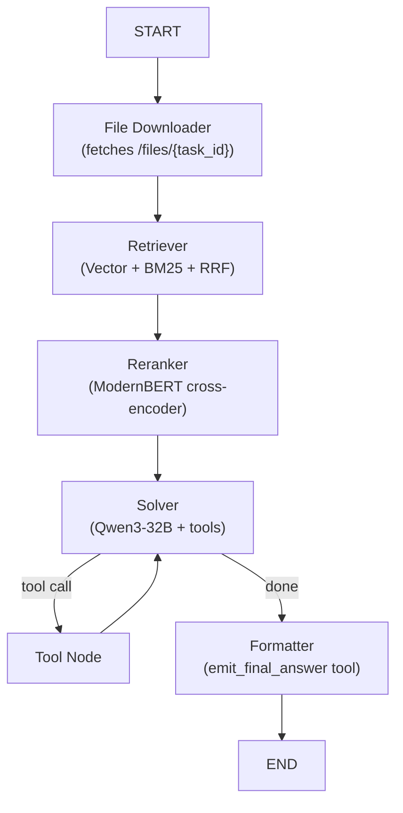

# 🌍 GAIA Benchmark Agent

**An autonomous, multi-modal agent that tackles the GAIA reasoning benchmark.**


> [!NOTE]
> Developed as part of the **Hugging Face Agents Course (Unit 4: GAIA)**.

## 📖 Overview

GAIA tasks require multi-step reasoning, tool use, and the ability to process diverse file types (documents, spreadsheets, audio, images, code). This agent uses a **LangGraph** state machine to plan, retrieve few-shot context, call tools, and produce a strictly-formatted answer.

The solver model is **`Qwen/Qwen3-32B`** via Hugging Face Inference Providers; the formatter (separate node) reuses the same model bound to a single `emit_final_answer` tool to enforce the strict GAIA output contract. A Supabase + BM25 hybrid retriever surfaces similar past tasks as few-shot exemplars.

## 🚀 Key Features

- **🧠 Plan-Execute-Observe-Refine loop** driven by LangGraph.
- **🪜 Two-stage output**: a solver node reasons freely, then a dedicated formatter node returns the GAIA-compliant answer via a Pydantic-shaped tool call — eliminating regex parsing of the LLM's free text.
- **📂 Multi-modal file processing**:
  - **Documents**: PDF, Word (`.docx`), PowerPoint (`.pptx`), Text
  - **Data**: Excel (`.xlsx`, multi-sheet), CSV, JSON-LD, PDB (Protein Data Bank)
  - **Media**: Audio transcription (`openai/whisper-large-v3` via HF), image analysis (`Qwen/Qwen3-VL-32B-Instruct`)
  - **Code**: Python source files (read & execute)
  - **Archives**: ZIP extraction + inspection
- **🔍 Hybrid RAG**: Vector search (Supabase RPC over `Alibaba-NLP/gte-modernbert-base`) **+** BM25 over a local 165-question corpus, fused with Reciprocal Rank Fusion, then reranked with a ModernBERT cross-encoder.
- **🌐 Web tooling**: DuckDuckGo, Tavily, Wikipedia, ArXiv, full-page extraction (Trafilatura), YouTube transcripts.
- **🛠️ Modular tool layout**: tools are organised by domain in `gaia/tools/` (basic, web, files, media, dispatcher) so adding a new capability is a single-file change.

## 🏗️ Architecture


```mermaid
graph TD
    START --> FileDL["File Downloader<br/>(fetches /files/{task_id})"]
    FileDL --> Retriever["Retriever<br/>(Vector + BM25 + RRF)"]
    Retriever --> Reranker["Reranker<br/>(ModernBERT cross-encoder)"]
    Reranker --> Processor["Solver<br/>(Qwen3-32B + tools)"]
    Processor -->|tool call| Tools["Tool Node"]
    Tools --> Processor
    Processor -->|done| Formatter["Formatter<br/>(emit_final_answer tool)"]
    Formatter --> END
```

| Node | Role |
| :--- | :--- |
| **`file_downloader_node`** | If the question has an associated file, download from `{api.base_url}/files/{task_id}` and cache on disk under `data/task_files/{task_id}/`. |
| **`retriever_node`** | Hybrid search: Supabase vector RPC + local BM25 over `data/metadata.jsonl`, fused with RRF. Returns up to 20 candidate task IDs. |
| **`reranker_node`** | `Alibaba-NLP/gte-reranker-modernbert-base` re-scores candidates and injects the top-K as few-shot examples (Question + Final Answer + Solution Steps). |
| **`processor_node`** | Qwen3-32B with all tools bound. Reasons, calls tools, loops until satisfied. |
| **`tools`** | LangGraph `ToolNode` executing the chosen tool, then returning control to the processor. |
| **`formatter_node`** | A second Qwen3-32B call bound to a single `emit_final_answer(answer: str)` tool — produces the strictly-formatted value the GAIA scorer compares against. |

## 🛠️ Stack

| Category | Libraries | Purpose |
| :--- | :--- | :--- |
| **Orchestration** | `langgraph`, `langchain`, `langchain-huggingface` | State graph, tool binding, structured output. |
| **LLM / VLM / ASR** | `huggingface_hub` Inference API | `Qwen/Qwen3-32B`, `Qwen/Qwen3-VL-32B-Instruct`, `openai/whisper-large-v3`. |
| **Embeddings & Vector Store** | `sentence-transformers`, `supabase` | Semantic search via `Alibaba-NLP/gte-modernbert-base`. |
| **Keyword search** | `bm25s` | Local BM25 index over the 165-question GAIA corpus. |
| **Documents** | `pypdf`, `python-docx`, `python-pptx`, `openpyxl` | Office formats. |
| **Data** | `polars`, `biopython` | Tabular and PDB structural analysis. |
| **Media** | `pillow`, `librosa`, `soundfile` | Image + audio I/O. |
| **Web** | `ddgs`, `tavily-python`, `wikipedia`, `arxiv`, `trafilatura`, `youtube-transcript-api` | Search, page extraction, captions. |
| **UI** | `gradio` | Evaluation runner (HF Space entry point). |

## 💻 Installation & Setup

```bash
git clone <repo_url>
cd gaia
uv sync                            # or: pip install -r requirements.txt
cp .env.example .env               # populate the keys below
```

Required environment variables (place in `.env` or set as HF Space Secrets):

| Variable | Required? | Purpose |
| :--- | :--- | :--- |
| `HF_INFERENCE_KEY` | yes | Hugging Face token — must have **"Make calls to Inference Providers"** permission. |
| `SUPABASE_URL` | yes (if `retrievers.enable_vector_search: true`) | Supabase project URL. |
| `SUPABASE_SERVICE_KEY` | yes (same) | Supabase `service_role` key. |
| `TAVILY_API_KEY` | optional | Only needed when the agent picks `tavily_web_search`. |

## 🎮 Usage

Start the Gradio interface:

```bash
python app.py
```

The UI requires a Hugging Face login. Click **"Run Evaluation & Submit All Answers"** to fetch the GAIA question set, run the agent on each, and submit to the scoring API.

> [!NOTE]
> **Known limitation — file-based questions are currently unanswerable.** As of the latest test pass, the scoring API (`GET /files/{task_id}`) returns `404 "No file path associated with task_id …"` for every task in the current round that has an attached file (chess image, audio recipes, the Python script, the fast-food sales spreadsheet). The agent recovers cleanly — it calls `retry_file_download` once and then emits `FINAL ANSWER: unknown` rather than fabricating — but those questions can't be scored until the API serves the underlying files again.
> See https://github.com/huggingface/agents-course/issues/624 for progress on resolution of this issue.

To (re)populate the Supabase vector store from the local corpus:

```bash
python scripts/create_vector_database.py
```

## 📂 Project Structure

```
.
├── app.py                              # HF Space entry point (Gradio)
├── config.yaml                         # All tunable parameters
├── pyproject.toml / requirements.txt   # Dependencies (uv + pip parity)
├── gaia/                               # Application package
│   ├── agent.py                        # LangGraph nodes, graph, formatter
│   ├── states.py                       # AgentState TypedDict
│   ├── utils.py                        # config / prompt loaders, BM25, RRF, answer + youtube helpers
│   ├── prompts/
│   │   ├── prompt.yaml                 # Solver system prompt
│   │   └── vlm_prompt.yaml             # analyze_image system prompt
│   └── tools/
│       ├── __init__.py                 # Aggregates tools_list
│       ├── basic.py                    # calculator, python_eval
│       ├── web.py                      # ddg / tavily / wiki / wikipedia_page_fetch / arxiv / fetch_webpage / youtube_transcript / retry_file_download
│       ├── files.py                    # PDF, DOCX, PPTX, TXT, CSV, XLSX, JSON-LD, PDB, Python, ZIP
│       ├── media.py                    # analyze_image (VLM), transcribe_audio (ASR), shared HF client
│       └── dispatcher.py               # read_file extension router
├── scripts/
│   └── create_vector_database.py       # One-shot embedder for Supabase
├── notebooks/                          # Exploratory work
├── data/
│   └── metadata.jsonl                  # Local GAIA corpus (165 examples)
└── models/                             # HF model cache (gitignored)
```

All tunable knobs — model IDs, retrieval depth, thinking mode, recursion limit — live in `config.yaml`; no code change required to swap models or tweak retrieval.

## 📜 License

This project is licensed under the MIT License — see [LICENSE](LICENSE) for the full text.
